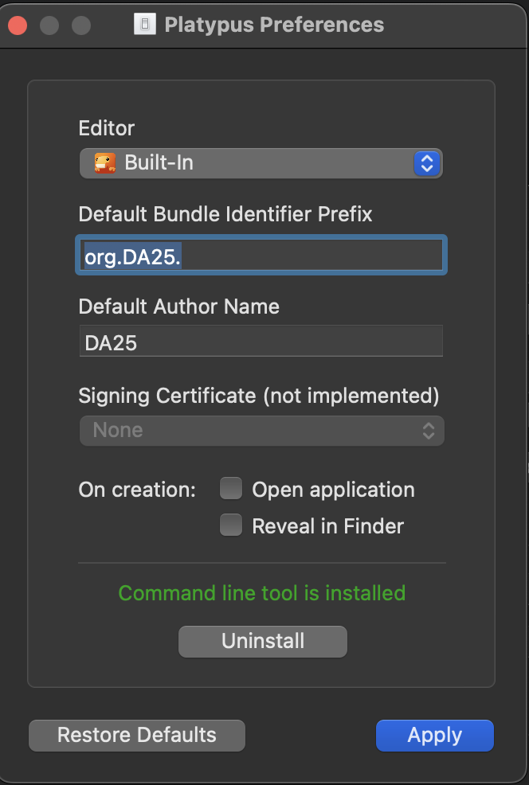

# wts

1. `chmod +x ./bin/build.sh`
2. `chmod +x ./bin/create-app.sh`
3. `chmod +x ./bin/clean.sh`
4. `source ./bin/build.sh`
5. Open Platypus App on Mac and install cmd line. Platypus Menu > Settings > Install Command Line

6. `./bin/create-app.sh`
7. `./bin/clean.sh`
